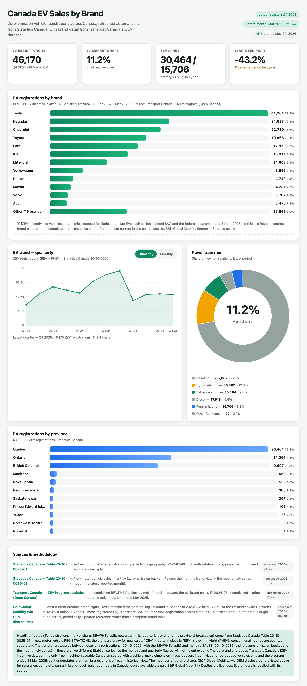

# Canada EV Sales by Brand — self-updating dashboard

A local web page that shows up-to-date zero-emission vehicle (EV) registrations in
Canada — headline totals, market share, powertrain mix, a trend you can switch between
**quarterly and monthly**, a provincial breakdown, and a by-brand ranking. It
**refreshes itself**: a `launchd` agent pulls fresh data on a schedule and the page
re-renders automatically.

Live at **http://127.0.0.1:8787/** once installed (loopback only — not exposed to your network).



---

## Data sources (and why they're credible)

Every figure on the page is labelled with its source. The honest reality of Canadian
EV data shaped the design: the authoritative government source has **no brand
dimension**, and there is **no free, live, brand-level feed**. So the dashboard layers
three credible sources and is explicit about each one's limits.

| Layer | Source | What it powers | Credibility / caveat |
|---|---|---|---|
| **Spine** | **Statistics Canada**, Table [20-10-0025-01](https://www150.statcan.gc.ca/t1/tbl1/en/tv.action?pid=2010002501) — new motor vehicle registrations, quarterly, by geography | EV totals, market share, BEV/PHEV split, powertrain mix, quarterly trend, by-province | National statistical authority. Open Licence. Quarterly (irregular release cadence). No brand dimension exists in any active StatCan table — confirmed by scanning all 8,200+ cubes. |
| **Monthly** | **Statistics Canada**, Table [20-10-0085-01](https://www150.statcan.gc.ca/t1/tbl1/en/tv.action?pid=2010008501) — new motor vehicle sales, monthly | The monthly trend view (toggle) + the "latest month" header badge | National authority, Open Licence, **most timely** (through the latest reported month). Zero-emission is a single bucket here (no BEV/PHEV split), and it's *sales* not *registrations* — so the monthly and quarterly series won't tie out exactly. |
| **Brand** | **Transport Canada — iZEV program** ([Open Canada dataset](https://open.canada.ca/data/en/dataset/42986a95-be23-436e-af15-7c6bf292a2e1)) | The by-brand chart (make-level BEV/PHEV) | Government provenance, machine-readable, redistributable (OGL-Canada). **But:** incentivized + price-capped vehicles only (undercounts premium brands, e.g. excludes Tesla Model S/X), and the program **ended 31 Mar 2025** — a frozen historical brand picture, not a complete or current count. |
| **Current shares** | **S&P Global Mobility** (via OEM disclosures) | A reference note in Sources | Authoritative brand-level origin (S&P is what Transport Canada's own ZEV dashboard runs on), surfaced as a periodically-reviewed reference — the raw S&P dataset is paywalled and not redistributable. |

> **"Sales" vs "registrations":** the StatCan figures are new **registrations**, the standard
> proxy for new-vehicle sales. "ZEV" = battery-electric (BEV) + plug-in hybrid (PHEV);
> conventional hybrids are counted separately.

If you need complete, current, brand-level Canadian EV data, the only path is a paid
**S&P Global Mobility** or **DesRosiers** licence. This dashboard gets as close as the
free/credible sources allow, and says so on the page.

---

## How the auto-update works

Two user-level `launchd` agents (no `sudo`, fully reversible):

- **`com.dvaladares.evcanada.update`** — runs `fetch_data.py` **at login and daily at 09:00**.
  It pulls the StatCan slices (tiny coordinate-API calls) every run, and re-downloads +
  re-aggregates the iZEV brand file at most weekly (cached in `data/raw/`). StatCan releases
  at 08:30 ET, so the 09:00 run catches new data the same day.
- **`com.dvaladares.evcanada.server`** — keeps a loopback web server alive on port 8787
  (`KeepAlive`), so the page is always reachable.

Each run writes `site/data/ev_sales.json`, embeds the same snapshot inline into
`site/index.html` (so the page also works opened directly as a file), and updates
`data/meta.json`. An open browser tab re-checks `data/ev_sales.json` every 60 minutes and
re-renders if the data changed — no manual reload needed.

```
data release  ──►  launchd (daily 09:00 / at login)  ──►  fetch_data.py
                                                              │
                 StatCan WDS API  ─┐                          ├─►  site/data/ev_sales.json
                 iZEV CSV (cached) ─┤── normalize to schema ──┤─►  embed into index.html
                 S&P note (static) ─┘                          └─►  data/meta.json + logs
                                                              │
        browser (polls every 60 min)  ◄── loopback server ◄──┘
```

---

## Install / manage

```sh
cd ~/Developer/ev-canada-dashboard
./scripts/install.sh            # generate + load both launchd agents, do a first refresh
open http://127.0.0.1:8787/     # view it
```

Other commands:

```sh
./scripts/run_update.sh             # refresh data now (manual)
./scripts/run_update.sh --force-izev  # also re-download the iZEV brand file now
./scripts/uninstall.sh              # stop + remove both agents (project files untouched)
tail -f logs/update.log             # watch refreshes
cat data/meta.json                  # last run summary
```

Change the port: `EVDASH_PORT=9000 ./scripts/install.sh`.
Use a specific Python: `EVDASH_PYTHON=/opt/homebrew/bin/python3 ./scripts/install.sh`.

To reach it from another device on your Tailscale mesh, change the server bind in
`scripts/serve.sh` from `127.0.0.1` to `0.0.0.0` (or your Tailscale IP) and re-install —
but be aware that exposes the page to your tailnet.

---

## Project layout

```
ev-canada-dashboard/
├── fetch_data.py          # the pipeline (Python stdlib only — no pip installs)
├── site/
│   ├── index.html         # the page (embeds a data snapshot, regenerated each run)
│   ├── app.js             # dependency-free renderer + SVG charts + 60-min polling
│   ├── styles.css         # light/dark, responsive
│   └── data/ev_sales.json # generated: the live data the page fetches
├── data/
│   ├── meta.json          # last-run summary
│   └── raw/izev_brand.json# cached iZEV aggregate (refreshed ≤ weekly)
├── scripts/
│   ├── run_update.sh  serve.sh  install.sh  uninstall.sh
├── logs/                  # update.log + launchd stdout/err
└── README.md
```

## Data schema (`site/data/ev_sales.json`)

`status`, `generated_at`, `latest_period`, `totals` (ev_registrations_latest,
ev_share_pct_latest, bev_latest, phev_latest, yoy_growth_pct, period_label),
`powertrain_mix[]`, `ev_trend_quarterly[]`, `by_province_latest[]`, `by_brand[]`,
`by_brand_meta`, `sources[]`, `methodology`. The front-end is decoupled from the sources
via this schema, so adding/swapping a source only touches `fetch_data.py`.

## Notes & limitations

- The big Q1-2025 drop and negative year-over-year you'll see are **real**: the federal
  iZEV fund was exhausted (paused Jan 2025) and Québec paused its rebate — both dented ZEV
  registrations. The data is not wrong.
- StatCan's quarterly release cadence is irregular (multi-quarter catch-up batches happen).
  The daily poll handles this; it picks up whatever StatCan has published.
- The brand chart is iZEV-based and therefore historical/biased (see the on-page caveat).
  When a newer S&P-sourced brand disclosure appears, update `SP_BRAND_SHARES` in
  `fetch_data.py`.
- Updates only fire while the Mac is awake/logged in (standard `launchd` agent behaviour);
  a missed run is caught at next login and by the next daily fire.
